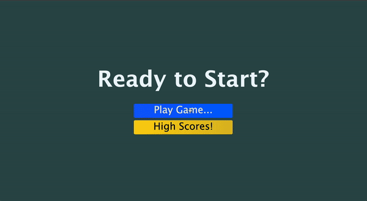

# Quiz-HW4
Created a quiz with HTML, CSS, and JavaScript
[Quiz Website](https://wmskillas.github.io/Quiz-HW4/)

## Questions
When you click on the correct answer you get green feedback as well as adding points to your score
When you click on the incorrect answer you get red feedback and no points are added to your score

## Buttons
The buttons take you to the dedicated html i.e Homepage takes you to the starting screen or homepage, 
play game takes you to the beginning of the game and so forth

## CSS
This project uses a common css file for many styling as well as another css file for specific items to the html